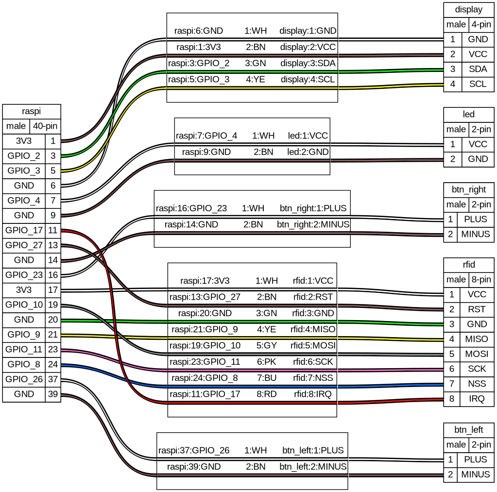

# Plastic Player 3

This is a remake of [Plastic Player 2](https://brendandawes.com/projects/plasticplayer2) ([repo](https://github.com/brendandawes/PlasticPlayer)), an NFC based controller for Spotify. This isn't a step by step instructables style build guide but hopefully there's enough information here to build your own version. Knowledge of building stuff like this, soldering and understanding Linux, software compilation and the like would be good.

## Materials

* **Raspberry Pi 4B** | [ CAD ](https://grabcad.com/library/raspberry-pi-4-model-b-1) | [ Amazon ](https://www.amazon.fr/dp/B07TGBLK33/)
* **128 x 64 I2C OLED**, [ CAD ](https://grabcad.com/library/arduino-0-91-0-96-inch-oled-1) | [ Amazon ](https://www.amazon.fr/dp/B0CN96XB5Y)
  NOTE: There are similar OLED modules with slightly different dimensions, e.g.:
  * https://grabcad.com/library/ssd1306-oled-display-128x64-1
  * https://grabcad.com/library/i2c-0-96-oled-ssd1306-display-1
  * https://grabcad.com/library/display-oled-ssd1306-de-0-96-1
  * Even when ordering twice from the same supplier (Amazon Link above), you can end up with 21 vs. 22 mm horizontal screw spacing
* [ **Joy-IT RFID module** ](https://joy-it.net/en/products/SBC-RFID-RC522) | [ CAD ](https://grabcad.com/library/rfid-rc5222-1) | [ Amazon ](https://www.amazon.fr/dp/B07B3N1WTL)
  * _TODO_: here too it seems the screw spacing does not 100% correspond
* 2 x **Sanwa Arcade Buttons** | [ CAD ](https://grabcad.com/library/sanwa-obsf-24-arcade-button-1) | [ Amazon ](https://www.amazon.fr/dp/B075DCB7LT)
* **NFC Stickers** | [ Amazon ](https://www.amazon.fr/dp/B0BVFM8YVD)
* 3D printed enclosure and slides (available on this repo)
* **screws**
  * display screws: 4x M1.7*5 PA Phillips self-tapping screw
  * Raspberry Pi screws: 4x M2*4
  * RF tag reader screw: 2x M3*4
  * case screws: 3x M3*8
* **magnets**
  * 2x Neodyme magnet 6x2 mm
  * 2x Neodyme magnet 3x2 mm
* **rubber feet** | e.g. cylindrical 8.5x2 mm [Amazon](https://www.amazon.fr/dp/B09KTCFC1L)
* a Spotify Premium account

## Hardware



## Building

### Setting up buildroot

```sh
docker build -t buildroot docker
docker run --rm -it -v ${PWD}:/workspace buildroot bash
make -C buildroot/ BR2_EXTERNAL=../br-external O=../output raspberrypi4-64-rauc_defconfig
```

### Building the web app

Install Flutter: https://docs.flutter.dev/get-started/install.

```sh
cd web_ui
flutter build web
rsync -avh --delete build/web/ ../br-external/board/raspberrypi/rootfs-overlay/usr/html
```

### Building the image

```sh
docker run --rm -it -v ${PWD}:/workspace buildroot bash
make -C output/
```

## Developing

### SSH config

````
Host pp3
    HostName 192.168.0.14
    User user
    IdentityFile ~/.ssh/id_ed25519
    StrictHostKeyChecking=no
    UserKnownHostsFile=/dev/null
```

### Syncing the web app

```sh
rsync --rsync-path="sudo rsync" -avh --delete web_ui/build/web/ pp3:/usr/html
```

## Appendix

### Wiring

```sh
docker run --rm -it -v ${PWD}:/workspace buildroot pipx run wireviz /workspace/hw/wiring.yml
```
