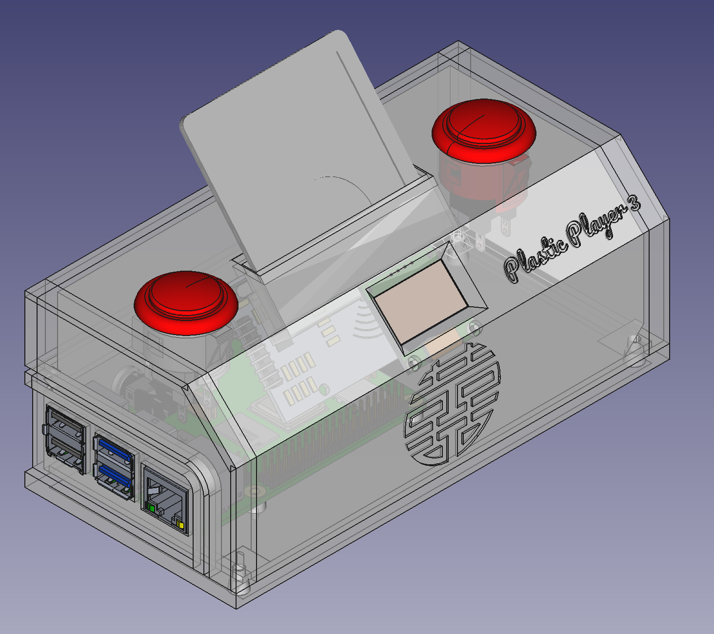

# Plastic Player 3

||
|:---:|
| The original Plastic Player 2 |

||
|:---:|
| A 3D model of Plastic Player 3 |

This is a remake of [Plastic Player 2](https://brendandawes.com/projects/plasticplayer2) ([repo](https://github.com/brendandawes/PlasticPlayer)), an NFC based controller for Spotify. This isn't a step by step instructables style build guide but hopefully there's enough information here to build your own version. Knowledge of building stuff like this, soldering and understanding Linux, software compilation and the like would be good.

# Materials

* **Raspberry Pi 4B** | [ CAD ](https://grabcad.com/library/raspberry-pi-4-model-b-1) | [ Amazon ](https://www.amazon.fr/dp/B07TGBLK33/)
* **128 x 64 I2C OLED**, [ CAD ](https://grabcad.com/library/ssd1306-oled-display-128x64-1) , [ Amazon ](https://www.amazon.fr/dp/B0CN96XB5Y)
  * _TODO_: find SSD1306 model with correct screw spacings
  * https://grabcad.com/library/i2c-0-96-oled-ssd1306-display-1     <- NOTE: this model's screw spacing is much closer to my module, but the height seems larger
* [ **Joy-IT RFID module** ](https://joy-it.net/en/products/SBC-RFID-RC522) | [ CAD ](https://grabcad.com/library/rfid-rc5222-1) | [ Amazon ](https://www.amazon.fr/dp/B07B3N1WTL)
  * _TODO_: here too it seems the screw spacing does not 100% correspond
* 2 x **Sanwa Arcade Buttons** | [ CAD ](https://grabcad.com/library/sanwa-obsf-24-arcade-button-1) | [ Amazon ](https://www.amazon.fr/dp/B075DCB7LT)
* **NFC Stickers** | [ Amazon ](https://www.amazon.fr/dp/B0BVFM8YVD)
* 3D printed enclosure and slides (available on this repo)
* a Spotify Premium account

How it Works
------------

[Watch the Video](https://vimeo.com/251775077)

Plastic Player has two main components — A Raspberry Pi running the Musicbox system and an Espruino WiFi based controller. 

The Raspberry Pi manages and plays the music and it's this you'll connect to your stereo system. 

The controller is what you can build with this repo. The controller uses 35mm photographic slides with NFC stickers to play anything on Spotify. This uses an Espruino Wifi board. Of course you don't have to use 35mm slides — it could be anything you can put an NFC sticker onto.

When you power up the Plastic Player the Espruino connects to your WiFi network and pulls down data in the form of a JSON file — I use [Airtable](http://airtable.com) as a simple solution but you could use anything, even a flat text file, as long as it's JSON formatted in the correct way. This JSON file contains a list of NFC tag ids with matching Spotify URIs — these are your albums. When you place an album (slide) into Plastic Player, the Espruino sees the NFC tag and looks-up that tag in the JSON file.  When it finds a match it sends the corresponding Spotify URI to the Musicbox over wifi and then starts that track list playing. Plastic Player also includes controls for play/pause and skip (next track).

# Raspberry Pi

Install Musicbox on a Raspberry Pi following the instructions on the Musicbox site including entering your Spotify details. Once you have this set up, check you can connect to it via your web browser — usually via musicbox.local. 

Make sure to note down the ip address of the Raspberry Pi as you'll need to enter this in the code for Espruino later. You can find this out via the Terminal by typing 'ping musicbox.local'. This will show the ip address of the Raspberry Pi you have running Musicbox.

That’s all you need to do with the Raspberry Pi. 


## Pinout

NOTE: This renders better with Mermaid 11.0.2:


# Setting up the software

On MacOS:

```
	brew install arduino-cli
  make build
```

NOTE: For Linux, you will have to adapt the download link of the toolchain in the Makefile.

Then, download the toolchain from https://github.com/me-no-dev/RasPiArduino/releases/tag/0.0.1.

Since this is a 32-bit toolchain, you will also need a 32-bit OS image. You can select "Raspberry
Pi OS Lite (32-bit)" in the Raspberry Pi Imager tool.

Once you have set up your target Raspberry Pi, you need to push some binaries:

```sh
# TODO: check if this is neccesary
scp -r piduino/tools/arpi_bins/* <TARGET>:/usr/local/bin/
```

## Installing spotifyd on the target

```sh
wget https://github.com/Spotifyd/spotifyd/releases/download/v0.3.5/spotifyd-linux-armhf-full.tar.gz
tar xvf spotifyd-linux-armhf-full.tar.gz
```

Create `/etc/spotifyd.conf` with the following content (see also https://docs.spotifyd.rs/config/File.html):

```
use_mpris = true
device_name = "PlasticPlayer3"
cache_path = "/home/holger/spotifyd-cache"
# The maximal size of the cache directory in bytes
# The example value corresponds to ~ 1GB
max_cache_size = 1000000000
```

NOTE: Login does not seem to work right now: https://github.com/Spotifyd/spotifyd/issues/1293

You can test if the daemon works well in discovery mode and if the DBUS MPRIS interface is up using
the following commands:

```sh
sudo apt install playerctl
./spotifyd --no-daemon
playerctl play
playerctl pause
```

# Enclosure

You can enclose this project in whatever you see fit but I've included the .stl files for you to use and either print at home of send to a service such as Shapeways to create the enclosure. Once you have that you can place the parts and then snap-fit the enclosure back together.

To provide power to the Plastic Player, I used a panel mount female USB (see parts list above) which I then attached to another USB lead I had cut up, wiring the cut end to the panel mount USB and plugging the male end into the Espruino as normal.

NFC Tags
--------

Place an NFC tag on a slide and place it into the Plastic Player. Any unknown tags will display the tag ID on the OLED display. You can then use this information in the JSON file (see below).

Setting up the database of albums
---------------------------------

Plastic Player consults a JSON file to match NFC tags with Spotify albums URIs. An example JSON schema is included in this repo. I use Airtable to easily manage and serve this file but you can use whatever you want as long as it's web accessible. 

Construct your JSON file using the tag IDs and the corresponding Spotify URIs.

Once you have this JSON file done and existing on the web, and that location is in the PATH variable as detailed above, then when you place the relevant NFC tag into the Plastic Player it should talk to the Musicbox and play!


