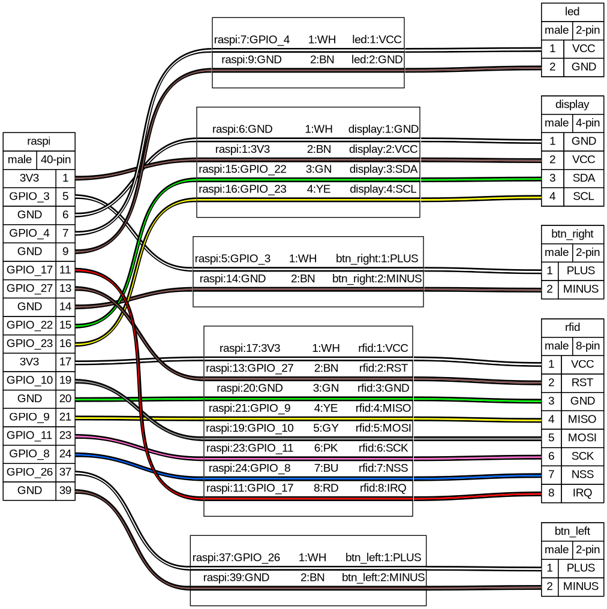

# Plastic Player 3

This is a remake of [Plastic Player 2](https://brendandawes.com/projects/plasticplayer2) ([repo](https://github.com/brendandawes/PlasticPlayer)), an NFC based controller for Spotify. This isn't a step by step instructables style build guide but hopefully there's enough information here to build your own version. Knowledge of building stuff like this, soldering and understanding Linux, software compilation and the like would be good.

## System overview


*The TCP socket connection between pp3-core and librespot is a quick hack and should be replaced
by a clean D-Bus interface. [Spotifyd](https://github.com/Spotifyd/spotifyd) provides a D-Bus
media player interface and also uses `librespot` for playback, but it does not use an up-to-date
version of `librespot`...

## Materials

* **Raspberry Pi 4B** | [ CAD ](https://grabcad.com/library/raspberry-pi-4-model-b-1) | [ Amazon ](https://www.amazon.fr/dp/B07TGBLK33/)
* **128 x 64 I2C OLED**, [ CAD ](https://grabcad.com/library/arduino-0-91-0-96-inch-oled-1) | [ Amazon ](https://www.amazon.fr/dp/B0CN96XB5Y)
  NOTE: There are similar OLED modules with slightly different dimensions, e.g.:
  * https://grabcad.com/library/ssd1306-oled-display-128x64-1
  * https://grabcad.com/library/i2c-0-96-oled-ssd1306-display-1
  * https://grabcad.com/library/display-oled-ssd1306-de-0-96-1
  * Even when ordering twice from the same supplier (Amazon Link above), you can end up with 21 vs. 22 mm horizontal screw spacing
* [ **Joy-IT RFID module** ](https://joy-it.net/en/products/SBC-RFID-RC522) | [ CAD ](https://grabcad.com/library/rfid-rc5222-1) | [ Amazon ](https://www.amazon.fr/dp/B07B3N1WTL)
  * _TODO_: here too it seems the screw spacing does not 100% correspond
* 2 x **Sanwa Arcade Buttons** | [ CAD ](https://grabcad.com/library/sanwa-obsf-24-arcade-button-1) | [ Amazon ](https://www.amazon.fr/dp/B075DCB7LT)
* **NFC Stickers** | [ Amazon ](https://www.amazon.fr/dp/B0BVFM8YVD)
* 3D printed enclosure and slides (available on this repo)
* **screws**
  * display screws: 4x M1.7*5 PA Phillips self-tapping screw
  * Raspberry Pi screws: 4x M2*4
  * RF tag reader screw: 2x M3*4
  * case screws: 3x M3*8
* **magnets**
  * 2x Neodyme magnet 6x2 mm
  * 2x Neodyme magnet 3x2 mm
* **rubber feet** | e.g. cylindrical 8.5x2 mm [Amazon](https://www.amazon.fr/dp/B09KTCFC1L)
* a Spotify Premium account

## Hardware



## Building

### Setting up buildroot

```sh
docker build -t buildroot docker
docker run --rm -it -v ${PWD}:/workspace buildroot bash
make -C buildroot/ BR2_EXTERNAL=../br-external O=../output raspberrypi4-64-rauc_defconfig
cd br-external && ./openssl-ca.sh
```

The last line generates an OpenSSL certificate and signing key for RAUC firmware updates.
Note that you can only use the firmware update feature if the new firmware was signed with
the same key as the old firmware.

If you want to connect to the Plastic Player via SSH, put your public key in the `ssh-keys`
directory.

### Building on macOS

On macOS, you might run into two problems:

* `chmod: changing permissions of ...: Permission denied`: In Docker Desktop, go to Settings
  -> General -> Choose file sharing implementation for your containers -> gRPC FUSE (instead
  of VirtioFS)
* `undefined reference to __lll_lock_wake_private` and possibly other build errors in glibc:
  Put your build folder in a case-sensitive file system, see:
  * https://brianboyko.medium.com/a-case-sensitive-src-folder-for-mac-programmers-176cc82a3830
  * https://stackoverflow.com/questions/73417071/glibc-compilation-error-undefined-reference-to-lll-lock-wait-private
  * https://github.com/riscv-collab/riscv-gnu-toolchain/issues/742#issuecomment-1061055030

### Building the image

```sh
docker run --rm -it -v ${PWD}:/workspace buildroot bash
make -C output/ VERSION=<PUT VERSION HERE>
```

## Developing

### SSH config

```
Host pp3
    HostName 10.42.0.1
    User user
    IdentityFile ~/.ssh/id_ed25519
    StrictHostKeyChecking=no
    UserKnownHostsFile=/dev/null
```

### Syncing the web app

```sh
rsync --rsync-path="sudo rsync" -avh --delete web_ui/build/web/ pp3:/usr/html
```

## Appendix

### Wiring

```sh
docker run --rm -it -v ${PWD}:/workspace buildroot /venv/bin/wireviz -f p wiring.yml
```
